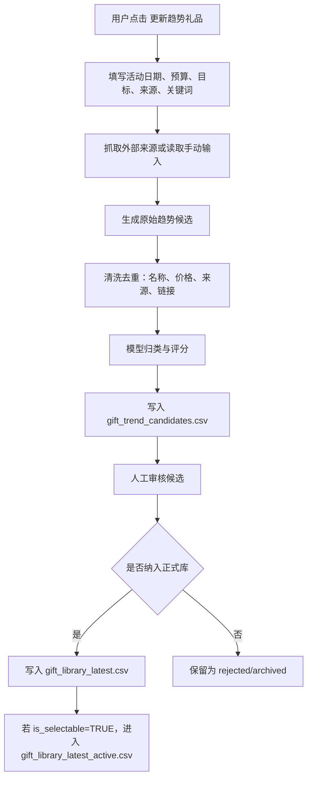

# TradingHero 礼品库 v2：手动更新趋势礼品设计稿

## 1. 目标

礼品库 v2 的目标不是做“实时自动推荐”，而是做一个可控的“手动更新趋势礼品”流程。

用户在前端点击按钮后，系统按指定来源和关键词抓取一批当下可能适合直播福利的礼品候选，再由 GPT/模型做归类、评分和适配判断。候选礼品默认不进入正式库，必须经过人工确认成本、库存、适用玩法后，才允许进入 `gift_library_latest_active.csv`，供 skill 和前端自动推荐。

核心原则：

- 趋势礼品只做候选，不直接进入自动推荐。
- 外部平台负责“新鲜度”，模型负责“理解、筛选、打分、组合”。
- 人工确认负责“成本、库存、是否真的可用”。
- 礼品预算计算只使用人工确认后的 `budget_cost`。

## 2. 当前礼品库状态

当前 v1.2 已有四类稳定礼品：

- 0 元库存礼品：好用的指标手册、黄金手机贴、马年钥匙扣、订单流桌垫、黄金知识桌垫。
- 已确认卡券：100元京东E卡、200元京东卡。
- 价格影响型福利：100元立减金、200元立减金。
- 已确认但待补成本的历史候选：来自 PDF/人工审核，但因为缺少 `budget_cost`，暂不进入自动推荐。

v2 在此基础上新增“趋势候选礼品”层。

## 3. 前端按钮设计

按钮名称：

`更新趋势礼品`

按钮位置建议：

- 礼品库页面顶部右侧。
- 与“导入礼品”“导出礼品库”“审核候选”并列。

按钮点击后打开一个更新弹窗，而不是立即抓取。

### 3.1 更新弹窗字段

必填：

- 活动日期：用于判断月份、节日、促销节点。
- 礼品预算区间：例如 0、1-50、51-100、101-150、151-200、200+。
- 目标：冲GMV / 冲销量 / 互动增强 / 前置蓄水。
- 来源平台：京东 / 淘宝天猫 / 抖音电商 / 小红书 / 手动链接 / 手动关键词。
- 关键词：例如 “夏季办公室礼品”“交易员桌面用品”“100元礼品”“京东E卡”“桌面小电器”。

选填：

- 最大候选数量：默认 30。
- 是否允许实物礼品。
- 是否允许卡券。
- 是否允许立减金。
- 是否只看 200 元以内礼品。
- 排除词：例如 “食品”“女性美妆”“儿童用品”“大件家电”。

### 3.2 按钮状态

- 默认：`更新趋势礼品`
- 抓取中：`正在更新...`
- 成功：`已更新 X 个候选`
- 部分失败：`部分来源失败，已保留成功结果`
- 失败：`更新失败，请检查来源或稍后重试`

### 3.3 更新记录展示

按钮旁展示最近一次更新摘要：

```text
上次更新：2026-07-06 14:30
来源：京东 / 小红书
关键词：夏季办公室礼品、交易员桌面用品
候选礼品：36 个
待确认：28 个
已纳入：8 个
```

## 4. 数据流程



## 5. 新增数据文件

### 5.1 `gift_trend_update_runs.csv`

记录每次点击更新的任务。

字段：

- `run_id`：更新任务 ID。
- `created_at`：点击更新时间。
- `activity_date`：活动日期。
- `source_platforms`：来源平台。
- `keywords`：关键词。
- `budget_range`：预算区间。
- `goal`：目标。
- `max_candidates`：最大候选数。
- `status`：success / partial_success / failed。
- `raw_count`：抓取原始数量。
- `candidate_count`：清洗后候选数量。
- `error_notes`：失败原因或异常说明。

### 5.2 `gift_trend_candidates.csv`

趋势候选主表。默认不进入正式礼品库。

字段：

- `candidate_id`：候选 ID。
- `run_id`：所属更新任务。
- `gift_name`：礼品名称。
- `normalized_name`：归一化名称。
- `source_platform`：来源平台。
- `source_url`：来源链接。
- `source_title`：来源标题。
- `source_rank`：榜单/搜索结果位置。
- `reference_price`：外部参考价。
- `price_confidence`：价格可信度，高/中/低。
- `budget_band`：预算档位，0 / 1-50 / 51-100 / 101-150 / 151-200 / 200+ / 待确认。
- `category`：实物 / 学习资料 / 卡券 / 立减金 / 大奖池 / 其他。
- `benefit_type`：gift / voucher / price_discount / idea_only。
- `suitable_months`：适合月份。
- `suitable_events`：适合场景。
- `suitable_play_types`：适合玩法。
- `persona_fit_notes`：TradingHero 人群适配说明。
- `trend_reason`：为什么认为它是趋势候选。
- `risk_notes`：风险说明。
- `hot_score`：热度分，0-5。
- `persona_fit_score`：人群适配分，0-5。
- `cost_control_score`：成本可控分，0-5。
- `live_show_score`：直播展示感，0-5。
- `conversion_score`：成交助推力，0-5。
- `gift_score`：综合分，0-100。
- `manual_status`：待确认 / 纳入正式库 / 拒绝 / 归档。
- `manual_actual_cost`：人工确认实际成本。
- `manual_budget_cost`：人工确认预算成本。
- `manual_market_price`：人工确认市场标价。
- `manual_stock_status`：充足 / 少量 / 缺货 / 待采购 / 待确认。
- `manual_notes`：人工备注。
- `updated_at`：最后更新时间。

### 5.3 `gift_trend_candidates_review.csv`

给前端审核页面使用的视图表，可由 `gift_trend_candidates.csv` 生成。

建议只显示核心字段：

- 礼品名称
- 来源平台
- 参考价
- 预算档位
- 综合分
- 推荐理由
- 风险
- 是否纳入正式库
- 实际成本
- 预算成本
- 库存状态
- 备注

## 6. 评分规则

综合分 `gift_score` 采用 100 分制：

```text
gift_score =
  hot_score * 15
  + persona_fit_score * 25
  + cost_control_score * 20
  + live_show_score * 15
  + conversion_score * 25
```

每个子分 0-5 分。

### 6.1 热度分 `hot_score`

判断来源：

- 平台热卖榜排名靠前。
- 多平台重复出现。
- 当前月份/节日相关。
- 近期搜索/内容平台讨论多。

评分：

- 5：多平台热，且与当前节点强相关。
- 4：单平台高热或多平台中热。
- 3：有一定热度，但证据一般。
- 2：只是普通商品。
- 1：几乎没有趋势依据。
- 0：无来源或来源不可信。

### 6.2 人群适配分 `persona_fit_score`

TradingHero 用户更适合：

- 交易学习资料。
- 订单流/指标/黄金/期货相关周边。
- 桌面办公用品。
- 小额现金感福利。
- 实用型小电器。

不太适合：

- 强女性美妆属性。
- 儿童用品。
- 大体积/高物流风险商品。
- 与交易/学习/办公完全无关的泛娱乐礼品。

### 6.3 成本可控分 `cost_control_score`

评分依据：

- 是否落在用户预算区间内。
- 是否易采购。
- 是否有库存或可替代。
- 是否物流成本低。

注意：

- 外部参考价不能直接当成本。
- 未人工确认成本前，不能进入 active 礼品库。

### 6.4 直播展示感 `live_show_score`

高分礼品特征：

- 主播能拿出来展示。
- 用户一眼能理解。
- 适合二选一、盲盒、抽奖、前N名。
- 有“现在买更划算”的表达空间。

低分礼品特征：

- 只能文字说明。
- 价值感弱。
- 太复杂，需要解释很久。

### 6.5 成交助推力 `conversion_score`

高分礼品：

- 现金感强，如京东卡、立减金。
- 与产品使用直接相关，如指标手册、订单流桌垫。
- 能降低决策阻力。

低分礼品：

- 只是热闹，但和购买理由关系弱。
- 成本高但感知价值不稳定。

## 7. 人工审核流程

趋势候选进入人工审核页后，必须经过以下步骤：

1. 查看来源和参考价。
2. 判断是否适合 TradingHero 用户。
3. 填写实际成本。
4. 填写预算成本。
5. 填写市场标价/感知价值。
6. 确认库存状态。
7. 选择适合玩法。
8. 决定是否纳入正式库。

审核结果：

- `纳入正式库`：写入 `gift_library_latest.csv`。
- `纳入并可自动推荐`：必须满足 `budget_cost` 有值、库存状态不是缺货、`is_selectable=TRUE`。
- `拒绝`：保留拒绝原因，避免下次重复推荐。
- `归档`：当前不使用，但未来可参考。

## 8. 进入正式库的门槛

候选礼品进入 `gift_library_latest_active.csv` 必须满足：

- `manual_status=纳入正式库`。
- `manual_budget_cost` 已填写。
- `manual_stock_status` 为 充足 / 少量 / 待采购但可采购。
- 无明显合规、物流、质量风险。
- 适合至少一种玩法。
- `gift_score >= 60`，或人工强制纳入。

不得自动进入 active 的情况：

- 只有平台参考价，没有人工成本。
- 库存状态不清楚。
- 来源链接失效。
- 高物流风险。
- 人群适配分低于 3。
- 只是“看起来热”，但不适合 TradingHero 用户。

## 9. 前端页面设计

### 9.1 礼品库首页

模块：

- 当前 active 礼品数。
- 0 元库存礼品数。
- 待审核趋势候选数。
- 上次趋势更新信息。
- `更新趋势礼品`按钮。

### 9.2 趋势候选审核页

表格列：

- 礼品名
- 来源平台
- 参考价
- 预算档位
- 综合分
- 适配理由
- 风险
- 状态
- 操作：纳入 / 拒绝 / 归档 / 编辑

筛选器：

- 来源平台
- 预算档位
- 综合分
- 类别
- 状态
- 适合月份
- 适合玩法

### 9.3 礼品详情抽屉

显示：

- 来源链接和抓取信息。
- 模型评分明细。
- 推荐理由。
- 风险说明。
- 人工确认字段。
- 进入正式库按钮。

## 10. 与 skill v2 的关系

skill v2 读取礼品时的优先级：

1. `gift_library_latest_active.csv`：正式可用礼品。
2. `gift_trend_candidates.csv`：只作为灵感，不能自动推荐。
3. `gift_trend_candidates_review.csv`：人工审核视图，不进入生成方案。

skill 输出方案时：

- 可以说“趋势候选建议人工确认后使用”。
- 不能把未确认趋势候选写成已确定福利。
- 如果使用立减金，必须重算最终支付价和 GMV。
- 如果使用京东卡，不能降低支付价。

## 11. 第一版实现范围

建议 v2.0 先实现：

- 手动更新按钮。
- 关键词输入。
- 手动来源/搜索结果导入。
- 生成 `gift_trend_candidates.csv`。
- GPT/模型评分。
- 人工审核表。
- 人工确认后合并进 `gift_library_latest.csv`。

暂不做：

- 后台自动定时抓取。
- 秒级实时价格。
- 自动采购。
- 自动进入 active。
- 多平台复杂反爬。

## 12. 推荐实施顺序

1. 先做 CSV 版趋势候选生成器。
2. 再把评分规则写进 skill v2。
3. 再做前端按钮和审核页面。
4. 最后接入具体外部来源。

第一阶段即使不接真实平台，也可以先支持“手动输入关键词 + 模型生成候选 + 人工审核”的轻量流程，用来验证字段和评分是否好用。

